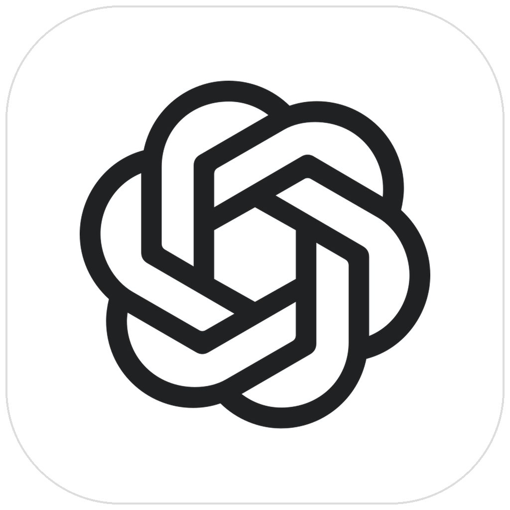
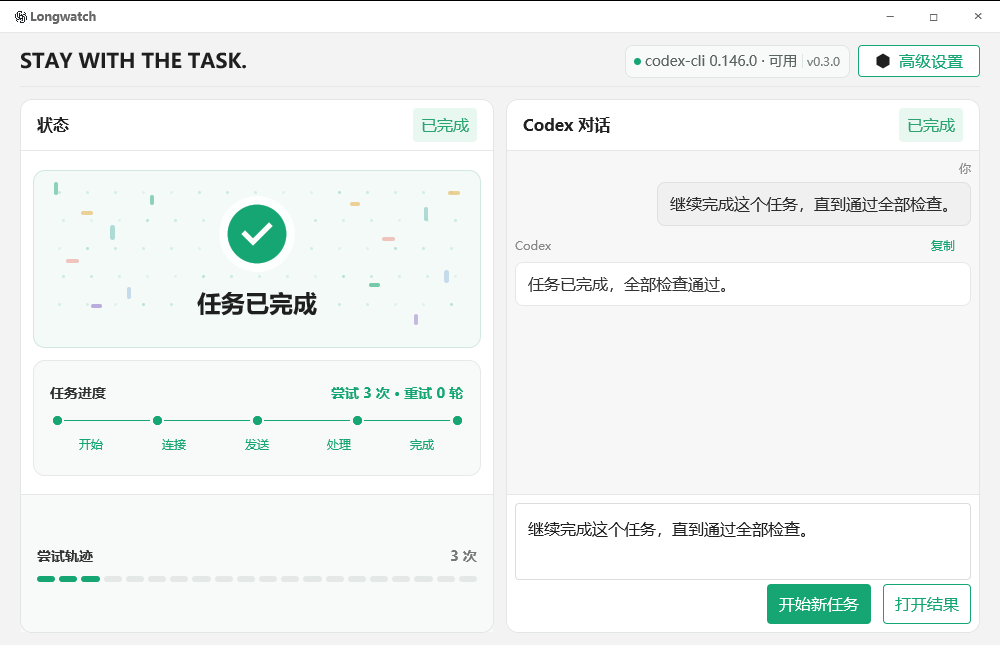

<p align="center">
  
</p>

<h1 align="center">Longwatch for Codex</h1>

<p align="center"><strong>Stay with the task.</strong></p>

<p align="center">
  A native desktop companion that keeps one Codex task alive through overloads, disconnects, restarts, and long waits—without running concurrent turns.
</p>

<p align="center">
  <a href="https://github.com/wintopic/codex-longwatch/actions/workflows/ci.yml"></a>
  <a href="https://github.com/wintopic/codex-longwatch/releases"></a>
  <a href="LICENSE"></a>
  
</p>

<p align="center">
  <a href="README.zh-CN.md">简体中文</a> ·
  <a href="#how-it-works">How it works</a> ·
  <a href="#installation">Installation</a> ·
  <a href="#privacy-and-safety">Privacy</a>
</p>



## Why Longwatch

Long Codex tasks sometimes encounter temporary capacity errors, a closed event stream, or a machine that sleeps halfway through the job. Retrying manually is distracting; blindly resubmitting is worse because it can create duplicate or overlapping work.

Longwatch owns the waiting loop. It sends the exact task you entered, keeps a single persistent Codex thread, classifies terminal outcomes, waits conservatively when retrying, and alerts you when a valid result arrives.

It does **not** generate filler prompts, rotate accounts, bypass limits, or run parallel turns.

## Highlights

- **One durable thread, one active turn.** A small deterministic state machine prevents overlapping requests.
- **Crash-safe reconciliation.** A submission marker is persisted before `turn/start`; after a restart, Longwatch resumes the thread and asks Codex what actually happened before it considers another send.
- **Protocol-first integration.** The primary transport is `codex app-server --listen stdio://`, using newline-delimited JSON-RPC.
- **Conservative retry policy.** Ordinary transient failures use exponential backoff from 30 seconds to 10 minutes with ±15% jitter and a hard 15-second floor.
- **Codex-aware outcomes.** Overload responses, selected HTTP failures, stream loss, empty replies, internal retries, authentication failures, and policy errors are handled differently.
- **Sleep-safe scheduling.** After system resume, Longwatch waits at least 60 seconds and never performs a burst of missed retries.
- **Native desktop experience.** GPUI interface, native notifications, Windows tray controls, deep-link/CLI result opening, and privacy-conscious diagnostics.
- **Explicit compatibility fallback.** Accessibility-driven GUI submission is available only when the user enables it; it never activates silently.
- **Cross-platform releases.** GitHub Actions builds a Windows installer and portable ZIP, Linux DEB/AppImage/tarball, and macOS DMG/portable app bundles for Intel and Apple Silicon.
- **Theme-aware macOS icon.** The running Dock icon switches between white/dark-mark and dark/white-mark variants with the system appearance.

## How it works

### State machine

```text
Idle
  └─ start ─> Connecting ─> Sending ─> Waiting
                 ▲             │           │
                 │             │           ├─ valid final reply ─> Success
                 │             │           ├─ retryable outcome ─> Backoff ─┐
                 │             │           └─ user-actionable error ─> Paused/FatalError
                 └─────────────┴──────────────────────────────────────────────┘
```

The runtime serializes all transitions through one Tokio task. `QueueMachine::begin_sending` rejects a new send while an active turn exists, and stale events from older turns are ignored.

### Wire protocol

The preferred path starts the official Codex CLI app server and exchanges newline-delimited JSON-RPC over stdio:

```text
initialize
thread/start or thread/resume
turn/start
item/agentMessage/delta          (volatile preview)
item/completed                   (authoritative message item)
turn/completed                   (terminal decision point)
turn/interrupt                   (pause, stop, or timeout)
```

The decoder intentionally keeps protocol payloads as tolerant `serde_json::Value` objects so adjacent Codex CLI versions can interoperate without binding Longwatch to every optional field.

### Recovery protocol: preventing duplicate submissions

The dangerous moment is the gap between sending `turn/start` and receiving its acknowledgement. A process can die inside that gap, leaving the client unsure whether the server accepted the turn.

Longwatch treats this as a small write-ahead protocol:

1. Record the attempt locally.
2. Persist `submissionUncertain = true` atomically.
3. Only then call `turn/start`.
4. Clear the marker after a turn ID is acknowledged or thread state is reconciled.
5. On restart, call `thread/resume` before any new submission.
6. If Codex reports an in-progress or completed turn, adopt that authoritative state.
7. If the outcome still cannot be proven, enter a normal backoff instead of immediately duplicating the request.

If the critical state cannot be written, Longwatch pauses **before** crossing the process boundary.

### Retry decisions

| Outcome | Longwatch behavior |
| --- | --- |
| `willRetry = true` | Keeps ownership with the current Codex turn; sends nothing extra |
| Current high-demand notice | Quiet immediate continuation without a red retry alert |
| Codex internal retry limit exhausted | Starts the next external round after a short settle delay |
| 429 / 502 / 503 / 504, overload text, transient process or stream loss | Conservative retry/backoff |
| Empty successful reply | Retries up to the configured empty-reply limit |
| Authentication, quota, policy, or invalid configuration | Pauses for user action |
| Protocol invariant failure | Enters `FatalError` |

The default application-level delay is:

```text
delay(n) = min(30s × 1.7^(n-1), 10m) × random(0.85 … 1.15)
```

App-server connection recovery uses a separate bounded sequence: 5 seconds, 15 seconds, then 60 seconds.

### Persistence model

Longwatch uses the operating system's standard configuration directory and atomically replaces JSON documents with temporary files.

- `config.json` stores user settings, including the task text, so the task can continue after restart.
- `state.json` stores thread/turn IDs, phase, counters, retry time, a prompt SHA-256 digest, and at most a 4,000-character reply preview.
- Streaming deltas remain in memory; terminal and safety-critical boundaries are persisted.
- Corrupt or future-version documents are quarantined as `*.corrupt-<timestamp>` and safe defaults are loaded.
- Existing CodexQueue data is migrated automatically when possible.

## Architecture

```text
GPUI / TDesign shell
        │ commands + snapshots
        ▼
QueueRuntime ── QueueMachine ── Retry classifier / wake detector
        │
        ├── Codex app-server transport (default)
        │      └── stdio JSON-RPC + persistent thread reconciliation
        │
        └── GUI compatibility transport (explicit opt-in)
               ├── OS accessibility submission
               └── incremental Codex session JSONL observation

Platform facade: notifications · tray · result opening · alerts · diagnostics
Persistence: atomic config/state JSON · daily logs · crash reports
```

| Path | Responsibility |
| --- | --- |
| `src/runtime.rs` | Serialized controller, recovery protocol, deadlines, persistence boundaries |
| `src/queue.rs` | Deterministic queue state machine and invariants |
| `src/app_server.rs` | Codex app-server lifecycle and JSON-RPC transport |
| `src/classifier.rs` | Retry, pause, and success classification |
| `src/backoff.rs` | Bounded backoff, jitter, attempt ledger, and wake detection |
| `src/config.rs` | Versioned config/state documents, migration, atomic writes |
| `src/gui_fallback.rs` / `src/jsonl.rs` | Explicit GUI fallback and incremental session observation |
| `src/ui.rs` | Native GPUI desktop interface |
| `crates/gpui_platform` | OS-specific notifications, tray, automation boundary, and icon behavior |

## Requirements

- Windows 10 version 1809 or later, macOS 12 or later, or a modern Linux desktop.
- A working `codex` executable available on `PATH`, or a configured Codex executable path.
- An existing Codex sign-in/session. Longwatch does not perform authentication for you.

## Installation

### Release builds

Download the appropriate artifact from [GitHub Releases](https://github.com/wintopic/codex-longwatch/releases):

- Windows: `Longwatch-<version>-windows-x64-setup.exe` or portable ZIP
- Linux: DEB package, AppImage, or portable tar.gz
- macOS: arm64/x64 DMG or portable `.app.tar.gz`

Release assets include SHA-256 checksum files. The current automated builds are not notarized; macOS or Windows may therefore show the platform's usual unsigned-app warning.

### Build from source

Install Rust 1.85+ and the native dependencies required by GPUI, then run:

```bash
git clone https://github.com/wintopic/codex-longwatch.git
cd codex-longwatch
cargo build --locked --release --all-features
```

Binary:

```text
target/release/codex-longwatch.exe   # Windows
target/release/codex-longwatch       # macOS / Linux
```

Linux development additionally needs Fontconfig, X11/XCB, Wayland, EGL, and OpenGL development packages. See the CI workflow for the current Ubuntu package list.

## Usage

1. Enter one real task for Codex.
2. Optionally choose a working directory.
3. Press `Ctrl+Enter` or click the primary action.
4. Leave Longwatch running; it will keep the thread serialized and wait through retryable failures.
5. Open the result from the completion notification, the app, or the Windows tray menu.

During an active task, task text and retry parameters are locked. Alert settings and the explicit GUI fallback switch can still be changed live. Use **Pause** to interrupt the active turn while keeping recoverable state, or **Stop** to clear the persisted Longwatch thread association.

## GUI compatibility fallback

The fallback is disabled by default and is only attempted after an explicit opt-in.

- **Windows:** UI Automation finds the Codex input, temporarily uses the clipboard, submits once, then restores clipboard text.
- **macOS:** Accessibility permission is requested before locating and submitting to the Codex input.
- **Linux:** AT-SPI plus one X11 Return event; Wayland sessions, including XWayland, are deliberately rejected for global input injection.

Completion is observed from new records in `CODEX_HOME/sessions/**/*.jsonl`. Existing file offsets are baselined first, partial lines and rotation are handled, and duplicate event IDs are ignored. The fallback cannot reliably change Codex's working directory, so it refuses tasks that request one.

## Privacy and safety

- Longwatch runs locally and talks to the locally installed Codex CLI.
- It inherits your existing `CODEX_HOME`, provider settings, and Codex authentication state.
- It does not read, request, or store API keys.
- It does not include a WebView, Node runtime, local HTTP server, remote-control service, telemetry client, or account switcher.
- The support report deliberately excludes task text, configuration files, environment variables, and credentials. It can include app/system versions, queue metadata, thread ID, a bounded reply/error preview, and recent Longwatch logs.
- GUI automation is opt-in and bounded by platform accessibility APIs. On Windows, only textual clipboard data is preserved by the fallback.

Review the local `config.json` and logs before sharing them publicly; they can contain your task text, working directory, and operational details.

## Troubleshooting

**Codex CLI unavailable**

Run `codex --version` in your normal shell, then confirm the executable path in Advanced Settings. Longwatch inherits the environment from the process that launches it.

**Longwatch keeps reconnecting**

Open the log directory from Advanced Settings and inspect the latest `longwatch.log.*` file. App-server stderr and the connection/retry timeline are recorded there.

**State-save warning**

Check disk space, directory permissions, and security software. Ordinary transient save failures keep the current task in memory; a failure at the critical pre-submission boundary pauses the queue to prevent a duplicate request.

**Damaged configuration**

Longwatch automatically moves the invalid document to a `.corrupt-<timestamp>` file and starts with safe defaults.

**Where are files stored?**

The exact path is platform-specific. Typical locations are `%APPDATA%\Longwatch\config` on Windows, `~/Library/Application Support/Longwatch` on macOS, and `~/.config/longwatch` on Linux. Logs and crash reports live below the same Longwatch directory. Existing installations migrate their previous Longwatch or CodexQueue directory automatically.

## Development

```bash
cargo fmt --all -- --check
cargo clippy --locked --all-targets --all-features -- -D warnings
cargo test --locked --all-features --all
cargo build --locked --release --all-features
```

The integration suite includes a fake app server and covers persistent resume, authoritative completed items, high-demand retry paths, internal retry ownership, process crashes, interrupts, uncertainty reconciliation, and non-duplication invariants. CI runs on Windows, Linux, macOS Intel, and macOS Apple Silicon. Tagged releases are packaged automatically with platform-native and portable artifacts plus SHA-256 checksums.

See [CONTRIBUTING.md](CONTRIBUTING.md) for the contribution workflow and [SECURITY.md](SECURITY.md) for private vulnerability reporting.

## Project status

Longwatch is an early-stage community project. The app-server protocol can evolve with Codex CLI releases, and automated releases are currently unsigned/not notarized. Back up important work and inspect release notes before upgrading.

## Name and trademark notice

Longwatch for Codex is an independent, unofficial open-source project. It is not affiliated with, endorsed by, sponsored by, or supported by OpenAI. Codex, ChatGPT, OpenAI, and related names and marks are trademarks of their respective owners. The bundled mark is used only to identify compatibility with the product and does not imply official status.

## License

Licensed under the [Apache License 2.0](LICENSE).

## Acknowledgements

- Built with [GPUI](https://crates.io/crates/gpui) and [TDesign-GPUI](https://github.com/wintopic/TDesign-GPUI).
- The deep-link, GUI-input, and session-observation direction was informed by [CodexPanel](https://github.com/wintopic/CodexPanel); Longwatch is an independent implementation and contains none of its non-commercially licensed source code.
